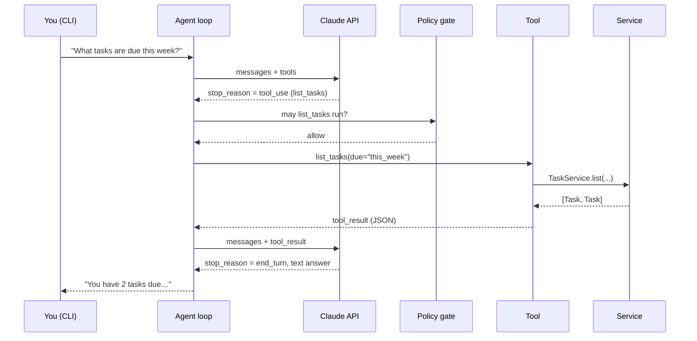
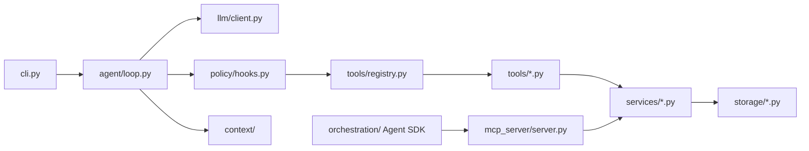

# System Architecture Diagrams

> Target design. Diagrams are updated as lessons are implemented.

## A chat request with a tool call

```mermaid
sequenceDiagram
  participant U as You (CLI)
  participant L as Agent loop
  participant C as Claude API
  participant P as Policy gate
  participant T as Tool
  participant S as Service

  U->>L: "What tasks are due this week?"
  L->>C: messages + tools
  C-->>L: stop_reason = tool_use (list_tasks)
  L->>P: may list_tasks run?
  P-->>L: allow
  L->>T: list_tasks(due="this_week")
  T->>S: TaskService.list(...)
  S-->>T: [Task, Task]
  T-->>L: tool_result (JSON)
  L->>C: messages + tool_result
  C-->>L: stop_reason = end_turn, text answer
  L-->>U: "You have 2 tasks due…"
```

## Component overview

```mermaid
flowchart LR
  CLI[cli.py] --> Agent[agent/loop.py]
  Agent --> LLM[llm/client.py]
  Agent --> Policy[policy/hooks.py]
  Policy --> Registry[tools/registry.py]
  Registry --> Tools[tools/*.py]
  Tools --> Services[services/*.py]
  Services --> Repo[storage/*.py]
  MCP[mcp_server/server.py] --> Services
  Research[orchestration/ Agent SDK] --> MCP
  Agent --> Context[context/]
```
